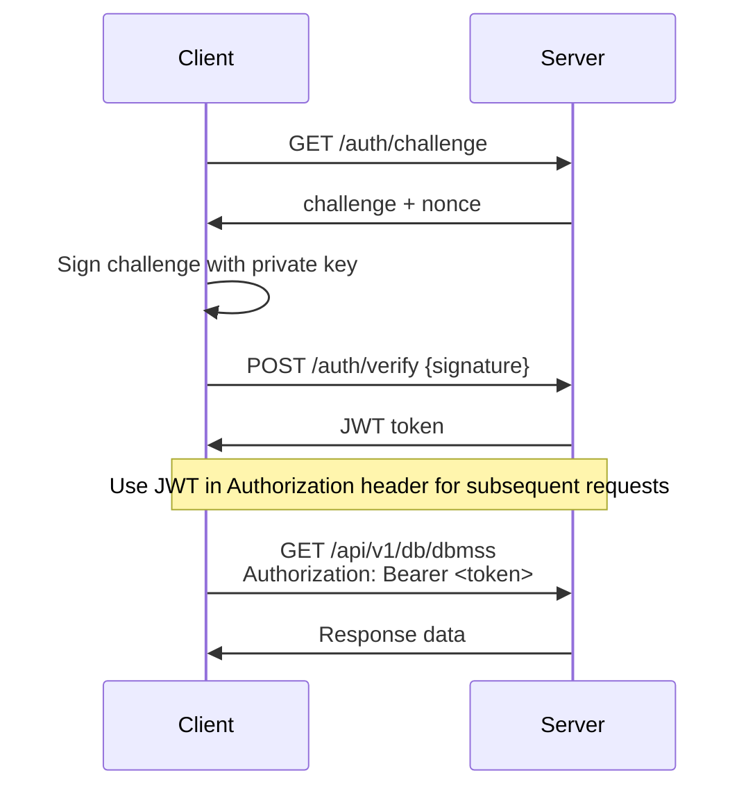

# API Reference

The Hot Fixture Tool server (`hfitd`) provides a comprehensive REST API for database access, file operations, and template management. This section covers the complete API specification with examples and integration guidance.

## API Overview

### Base Information

- **Base URL**: `https://your-hfitd-server.com`
- **API Version**: v1 (included in all endpoints)
- **Authentication**: JWT tokens via SSH key challenge-response
- **Content Type**: `application/json` for requests and responses
- **Data Format**: JSON for structured data, streaming for large datasets

### Authentication Flow



## Interactive API Documentation

<swagger-ui src="../../../hfitd/docs/swagger.yaml"/>

## Authentication Endpoints

### Get Authentication Challenge

Request a challenge for SSH key authentication.

```http
GET /auth/challenge?email=user@company.com
```

**Response:**
```json
{
  "challenge": "base64-encoded-challenge-string",
  "nonce": "random-nonce-string"
}
```

### Verify Authentication

Submit signed challenge to receive JWT token.

```http
POST /auth/verify
Content-Type: application/json

{
  "signature": "base64-encoded-signature",
  "nonce": "nonce-from-challenge"
}
```

**Response:**
```json
{
  "token": "jwt-token-string",
  "expires_at": "2024-03-16T10:30:00Z"
}
```

## Database API Endpoints

### List DBMS Providers

Get all configured database management system providers.

```http
GET /api/v1/db/dbmss
Authorization: Bearer <jwt-token>
```

**Response:**
```json
[
  "PROD_MYSQL",
  "STAGING_POSTGRES",
  "DEV_MYSQL"
]
```

### List Databases

Get databases available in a specific DBMS provider.

```http
GET /api/v1/db/{provider}/dbs
Authorization: Bearer <jwt-token>
```

**Parameters:**
- `provider` (path): DBMS provider name

**Response:**
```json
[
  "production_app",
  "production_analytics",
  "production_logs"
]
```

### List Tables

Get tables in a specific database.

```http
GET /api/v1/db/{provider}/{database}/tables
Authorization: Bearer <jwt-token>
```

**Parameters:**
- `provider` (path): DBMS provider name
- `database` (path): Database name

**Response:**
```json
[
  "users",
  "orders",
  "products",
  "payments"
]
```

### Stream Table Rows

Stream table data with optional SQL filtering.

```http
GET /api/v1/db/{provider}/{database}/{table}/rows?filter={sql_filter}
Authorization: Bearer <jwt-token>
```

**Parameters:**
- `provider` (path): DBMS provider name
- `database` (path): Database name
- `table` (path): Table name
- `filter` (query): Optional SQL WHERE clause

**Response:** Streaming JSON with table data

**Example with filter:**
```http
GET /api/v1/db/PROD_MYSQL/production_app/users/rows?filter=status='active' AND created_at >= '2024-01-01'
```

## File API Endpoints

### List Files

Browse files in a configured volume with optional filters.

```http
GET /api/v1/files/{volume}?name={pattern}&mtime={days}&size={condition}
Authorization: Bearer <jwt-token>
```

**Parameters:**
- `volume` (path): Volume name
- `name` (query): File name pattern with wildcards
- `mtime` (query): Modified time filter (days)
- `size` (query): Size filter (bytes with operators)

**Response:** Streaming JSON with file listings

**Examples:**
```http
# List all files
GET /api/v1/files/application_logs

# Filter log files from last 7 days
GET /api/v1/files/application_logs?name=*.log&mtime=7

# Find large files
GET /api/v1/files/backups?size=>1048576
```

### Download File

Download a specific file from a volume.

```http
GET /api/v1/files/{volume}/download?path={file_path}
Authorization: Bearer <jwt-token>
```

**Parameters:**
- `volume` (path): Volume name
- `path` (query): File path within the volume

**Response:** File content stream

**Example:**
```http
GET /api/v1/files/application_logs/download?path=2024/01/15/app.log
```

## Template API Endpoints

### List Templates

Get all package templates for the authenticated user.

```http
GET /api/v1/packtmpl
Authorization: Bearer <jwt-token>
```

**Response:**
```json
[
  "customer-onboarding-test",
  "payment-flow-scenario",
  "user-management-test"
]
```

### Get Template

Retrieve a specific template definition.

```http
GET /api/v1/packtmpl/{template_name}
Authorization: Bearer <jwt-token>
```

**Parameters:**
- `template_name` (path): Template name

**Response:** Template YAML content

### Create Template

Create a new package template.

```http
POST /api/v1/packtmpl
Authorization: Bearer <jwt-token>
Content-Type: text/plain

templateName: my-test-scenario
hfitVersion: "1.0"
description: "My test scenario"
exports:
  users:
    type: database
    provider: PROD_MYSQL
    query: |
      SELECT * FROM users 
      WHERE created_at >= DATE_SUB(NOW(), INTERVAL 7 DAY)
```

**Response:**
```json
{
  "message": "Template created successfully",
  "template_name": "my-test-scenario"
}
```

### Update Template

Update an existing template.

```http
PUT /api/v1/packtmpl/{template_name}
Authorization: Bearer <jwt-token>
Content-Type: text/plain

[Updated YAML content]
```

### Patch Template

Partially update a template with diff output.

```http
PATCH /api/v1/packtmpl/{template_name}
Authorization: Bearer <jwt-token>
Content-Type: text/plain

[Modified YAML content]
```

**Response:** Diff output showing changes

### Delete Template

Remove a template.

```http
DELETE /api/v1/packtmpl/{template_name}
Authorization: Bearer <jwt-token>
```

## Package Generation

### Generate Package

Create and download a data package from a template.

```http
POST /api/v1/packdownload
Authorization: Bearer <jwt-token>
Content-Type: application/json

{
  "template_name": "customer-scenario",
  "parameters": {
    "start_date": "2024-01-01",
    "end_date": "2024-01-31",
    "limit": "1000"
  }
}
```

**Response:** Streaming package data (SQL dumps, files, metadata)

## Error Responses

All API endpoints return structured error responses:

```json
{
  "category": "NOT_FOUND",
  "code": "TEMPLATE_NOT_FOUND",
  "message": "Package template 'nonexistent' not found",
  "resource": "nonexistent",
  "suggestions": [
    "List available templates with GET /api/v1/packtmpl",
    "Verify the template name is spelled correctly",
    "Create the template first with POST /api/v1/packtmpl"
  ],
  "timestamp": "1699027200"
}
```

### Error Categories

| Category | HTTP Status | Description |
|----------|-------------|-------------|
| `NOT_FOUND` | 404 | Resource not found |
| `AUTHENTICATION` | 401 | Authentication required or failed |
| `PERMISSION_DENIED` | 403 | Access forbidden |
| `VALIDATION_ERROR` | 400 | Invalid request data |
| `CONNECTION` | 500 | Database/infrastructure connection issues |
| `INTERNAL_ERROR` | 500 | Server-side errors |

## Rate Limiting

The API implements rate limiting to prevent abuse:

- **Default limit**: 60 requests per minute per IP
- **Headers returned**:
  - `X-RateLimit-Limit`: Request limit
  - `X-RateLimit-Remaining`: Remaining requests
  - `X-RateLimit-Reset`: Reset timestamp

**Rate limit exceeded response:**
```json
{
  "category": "RATE_LIMIT",
  "code": "RATE_LIMIT_EXCEEDED",
  "message": "Rate limit exceeded. Please wait before making more requests.",
  "suggestions": [
    "Wait for the rate limit to reset",
    "Reduce request frequency",
    "Contact administrator for higher limits"
  ]
}
```

## API Client Examples

### cURL Examples

#### Authentication Flow
```bash
# 1. Get challenge
curl -X GET "https://hfitd.company.com/auth/challenge?email=user@company.com"

# 2. Sign challenge (using openssl)
echo -n "$challenge" | openssl dgst -sha256 -sign ~/.ssh/private_key | base64

# 3. Verify and get token
curl -X POST "https://hfitd.company.com/auth/verify" \
  -H "Content-Type: application/json" \
  -d '{"signature":"signed_challenge","nonce":"nonce_value"}'
```

#### API Requests
```bash
# List DBMS providers
curl -H "Authorization: Bearer $TOKEN" \
  "https://hfitd.company.com/api/v1/db/dbmss"

# Stream table data
curl -H "Authorization: Bearer $TOKEN" \
  "https://hfitd.company.com/api/v1/db/PROD_MYSQL/production_app/users/rows"

# Download file
curl -H "Authorization: Bearer $TOKEN" \
  "https://hfitd.company.com/api/v1/files/logs/download?path=app.log" \
  -o downloaded_log.txt
```

### Python Client Example

```python
import requests
import json
from cryptography.hazmat.primitives import hashes, serialization
from cryptography.hazmat.primitives.asymmetric import padding
import base64

class HfitClient:
    def __init__(self, base_url, private_key_path):
        self.base_url = base_url
        self.private_key_path = private_key_path
        self.token = None
    
    def authenticate(self, email):
        # Get challenge
        response = requests.get(f"{self.base_url}/auth/challenge", 
                              params={"email": email})
        challenge_data = response.json()
        
        # Load private key
        with open(self.private_key_path, 'rb') as key_file:
            private_key = serialization.load_pem_private_key(
                key_file.read(), password=None)
        
        # Sign challenge
        challenge = base64.b64decode(challenge_data['challenge'])
        signature = private_key.sign(challenge, padding.PKCS1v15(), 
                                   hashes.SHA256())
        
        # Verify and get token
        verify_data = {
            "signature": base64.b64encode(signature).decode(),
            "nonce": challenge_data['nonce']
        }
        
        response = requests.post(f"{self.base_url}/auth/verify",
                               json=verify_data)
        token_data = response.json()
        self.token = token_data['token']
    
    def get_headers(self):
        return {"Authorization": f"Bearer {self.token}"}
    
    def list_dbms_providers(self):
        response = requests.get(f"{self.base_url}/api/v1/db/dbmss",
                              headers=self.get_headers())
        return response.json()
    
    def download_file(self, volume, path):
        response = requests.get(
            f"{self.base_url}/api/v1/files/{volume}/download",
            params={"path": path},
            headers=self.get_headers(),
            stream=True
        )
        return response.content

# Usage
client = HfitClient("https://hfitd.company.com", "~/.ssh/hfit_key")
client.authenticate("user@company.com")
providers = client.list_dbms_providers()
print(f"Available providers: {providers}")
```

### JavaScript/Node.js Example

```javascript
const axios = require('axios');
const crypto = require('crypto');
const fs = require('fs');

class HfitClient {
    constructor(baseUrl, privateKeyPath) {
        this.baseUrl = baseUrl;
        this.privateKeyPath = privateKeyPath;
        this.token = null;
    }
    
    async authenticate(email) {
        // Get challenge
        const challengeResponse = await axios.get(
            `${this.baseUrl}/auth/challenge`, 
            { params: { email } }
        );
        
        // Load private key
        const privateKeyPem = fs.readFileSync(this.privateKeyPath);
        
        // Sign challenge
        const challenge = Buffer.from(challengeResponse.data.challenge, 'base64');
        const signature = crypto.sign('sha256', challenge, privateKeyPem);
        
        // Verify and get token
        const verifyResponse = await axios.post(
            `${this.baseUrl}/auth/verify`,
            {
                signature: signature.toString('base64'),
                nonce: challengeResponse.data.nonce
            }
        );
        
        this.token = verifyResponse.data.token;
    }
    
    getHeaders() {
        return { Authorization: `Bearer ${this.token}` };
    }
    
    async listDbmsProviders() {
        const response = await axios.get(
            `${this.baseUrl}/api/v1/db/dbmss`,
            { headers: this.getHeaders() }
        );
        return response.data;
    }
    
    async generatePackage(templateName, parameters = {}) {
        const response = await axios.post(
            `${this.baseUrl}/api/v1/packdownload`,
            { template_name: templateName, parameters },
            { 
                headers: this.getHeaders(),
                responseType: 'stream'
            }
        );
        return response.data;
    }
}

// Usage
async function main() {
    const client = new HfitClient('https://hfitd.company.com', '~/.ssh/hfit_key');
    await client.authenticate('user@company.com');
    
    const providers = await client.listDbmsProviders();
    console.log('Available providers:', providers);
    
    const packageStream = await client.generatePackage('test-scenario');
    packageStream.pipe(process.stdout);
}

main().catch(console.error);
```

## OpenAPI Specification

The complete OpenAPI specification is available at:

- **Swagger UI**: `https://your-hfitd-server.com/swagger/`
- **OpenAPI JSON**: `https://your-hfitd-server.com/swagger/doc.json`
- **OpenAPI YAML**: `https://your-hfitd-server.com/swagger/swagger.yaml`

## WebSocket Support

For real-time operations, Hot Fixture Tool provides WebSocket endpoints:

### Package Generation Progress

```javascript
const ws = new WebSocket('wss://hfitd.company.com/ws/package-progress');

ws.onopen = function() {
    ws.send(JSON.stringify({
        action: 'generate',
        template: 'large-dataset-scenario',
        token: 'jwt-token'
    }));
};

ws.onmessage = function(event) {
    const progress = JSON.parse(event.data);
    console.log(`Progress: ${progress.percentage}% - ${progress.message}`);
};
```

## Security Considerations

### HTTPS Required

All API communications must use HTTPS in production environments.

### Token Security

- JWT tokens have a limited lifetime (default 24 hours)
- Tokens should be stored securely (not in localStorage for web apps)
- Implement token refresh mechanisms for long-running applications

### Input Validation

- SQL injection protection is built into the API
- File path traversal protection prevents access outside configured volumes
- Rate limiting prevents abuse

### Audit Logging

All API requests are logged server-side with:
- User identification
- Requested resources
- Timestamps
- IP addresses
- Response status codes

## Next Steps

- **[Client Installation](../client/installation.md)** - Install the official CLI client
- **[Template Creation Guide](../guides/template-creation.md)** - Create custom data templates
- **[Security Best Practices](../guides/security.md)** - Secure API usage patterns