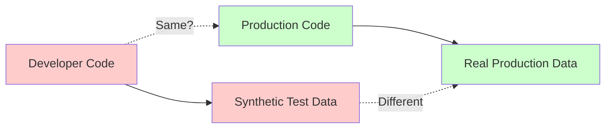
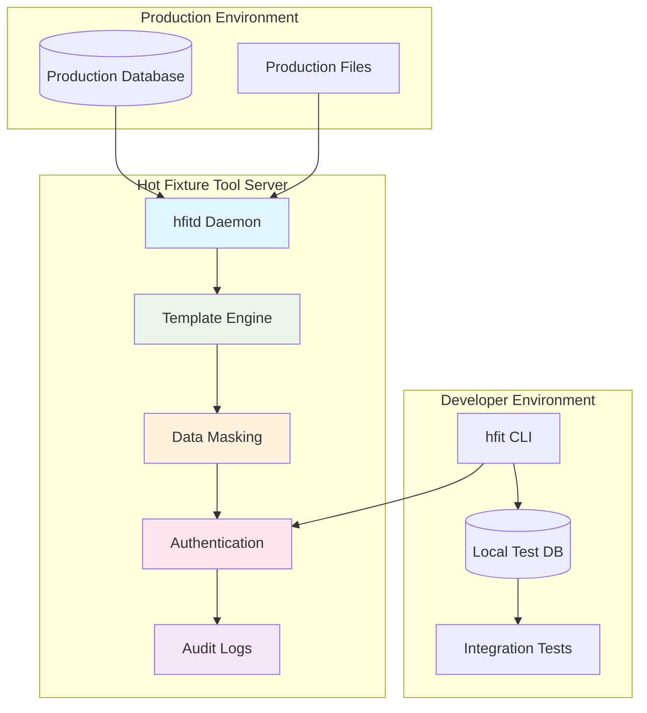

# Overview

## What is Hot Fixture Tool?

Hot Fixture Tool is a **developer productivity solution** that transforms how teams work with data. It solves the fundamental problem that developers face every day: **they have no access to the realistic data their code will actually process in production**.

## The Developer Data Crisis

### The Reality: Developers Work Blind



Every day, developers write code that will process complex production data, but they test it against oversimplified synthetic data. This disconnect causes:

- 🐛 **"Works on my machine" syndrome** - Tests pass locally but fail in production
- ⏰ **Hours wasted reproducing bugs** - Can't recreate production conditions locally  
- 🎭 **Mock maintenance nightmare** - Mocks become outdated and unrealistic
- 🚨 **Production surprises** - Issues only discovered after deployment

### The Traditional Development Problem

#### **What Developers Have Access To:**
```python
# Oversimplified test data
user = {
    "id": 1,
    "name": "John Doe", 
    "email": "john@example.com"
}
order = {
    "id": 1,
    "total": 100.00,
    "status": "completed"
}
```

#### **What Production Actually Looks Like:**
```python
# Real production complexity
user = {
    "id": 847291,
    "name": "José María Azañón-Dá Silva",
    "email": "jm.azanon+newsletter@empresa-consultoria.co.uk",
    "preferences": {
        "language": "es-MX",
        "timezone": "America/Mexico_City",
        "notifications": "weekly",
        "marketing_consent": False
    },
    "payment_methods": [
        {"type": "card", "last4": "4532", "expires": "2025-12", "status": "expired"},
        {"type": "paypal", "email": "different@email.com", "verified": False},
        {"type": "apple_pay", "device_id": "...", "status": "active"}
    ],
    "addresses": [
        {"type": "billing", "country": "ES", "vat_number": "ESB12345678"},
        {"type": "shipping", "country": "UK", "requires_customs": True}
    ],
    "subscription": {
        "plan": "premium",
        "billing_cycle": "annual", 
        "next_billing": "2024-12-15",
        "promo_codes": ["STUDENT20", "LOYALTY15"],
        "failed_payments": 2
    }
}
```

### The Development Productivity Impact

#### **Daily Developer Frustrations:**

1. **Morning Routine Pain**:
   ```bash
   # Traditional setup (45+ minutes)
   mysql test_db < old-synthetic-data.sql  # Outdated, unrealistic
   ./generate-test-users.py                # Artificial patterns
   ./setup-fake-orders.py                  # Missing complexity
   # Finally ready to start actual work
   ```

2. **Bug Investigation Hell**:
   ```
   🚨 Production Alert: "Payment failed for customer #184729"
   
   Developer response: "I can't reproduce this locally"
   
   Next 3 hours: Trying to guess what production data looked like
   - What was the customer's payment history?
   - What products were in the cart?
   - What promotional codes were applied?
   - What was the user's subscription status?
   ```

3. **Integration Testing Gaps**:
   ```python
   # Test passes with synthetic data
   @mock.patch('payment_service.charge')
   def test_checkout(mock_charge):
       mock_charge.return_value = {"status": "success"}
       # All green ✅
   
   # Production reality
   # - Payment service timeout during high load
   # - Currency conversion edge cases  
   # - Tax calculation for international orders
   # - Inventory conflicts with concurrent orders
   # All fail ❌
   ```

### Why Traditional Solutions Fail Developers

#### **1. Mock Everything Approach**
```python
# Maintenance nightmare
@mock.patch('user_service.get_user')
@mock.patch('payment_service.process_payment') 
@mock.patch('inventory_service.check_availability')
@mock.patch('shipping_service.calculate_cost')
@mock.patch('tax_service.calculate_tax')
@mock.patch('notification_service.send_email')
def test_complex_checkout(mock1, mock2, mock3, mock4, mock5, mock6):
    # 100+ lines of mock setup
    # Brittle, outdated, unrealistic
```

**Problems:**
- 🔧 **Constant maintenance** - Mocks break when APIs change
- 🎭 **Mock drift** - Mock behavior diverges from real services  
- 🚫 **Integration blindness** - Components work alone but fail together
- 📉 **False confidence** - Green tests that don't reflect reality

#### **2. Production Database Snapshots**
```bash
# Security nightmare
mysqldump production_db > dev_data.sql  # 5GB of sensitive data
scp dev_data.sql developer-laptop:/tmp/  # Compliance violation
```

**Problems:**
- 🚨 **Security risk** - Production data on uncontrolled devices
- 📋 **Compliance violation** - GDPR/HIPAA data everywhere
- 💾 **Impractical size** - Multi-gigabyte files for daily use
- ⏰ **Quickly outdated** - Snapshots stale within hours

#### **3. Synthetic Data Generators**
```python
# Artificial patterns
for i in range(1000):
    user = User(
        name=faker.name(),           # "John Smith" patterns
        email=faker.email(),         # Simple formats only
        orders=[fake_order()]        # No real business logic
    )
```

**Problems:**
- 🎯 **No business complexity** - Missing years of accumulated rules
- 🔗 **Missing relationships** - Artificial foreign key patterns
- 📊 **No performance reality** - Synthetic data doesn't stress test
- 🐛 **Edge case gaps** - Can't generate unusual real-world combinations

## Hot Fixture Tool: The Developer Productivity Revolution

### The Transformation

Hot Fixture Tool transforms the developer experience by providing **secure, controlled access to production-like data** that maintains all the complexity and business logic patterns your code will encounter in production.

```mermaid
graph TB
    subgraph "Before: Developer Frustration"
        A1[Synthetic Data] --> A2[False Confidence]
        A2 --> A3[Production Surprises]
        A3 --> A4[Long Debug Cycles]
        A4 --> A5[Developer Stress]
    end
    
    subgraph "After: Developer Confidence"
        B1[Real Data Templates] --> B2[Realistic Testing]
        B2 --> B3[Early Issue Detection]
        B3 --> B4[Fast Bug Resolution]
        B4 --> B5[Developer Productivity]
    end
    
    style A1 fill:#ffcccc
    style A2 fill:#ffcccc
    style A3 fill:#ffcccc
    style A4 fill:#ffcccc
    style A5 fill:#ffcccc
    
    style B1 fill:#ccffcc
    style B2 fill:#ccffcc
    style B3 fill:#ccffcc
    style B4 fill:#ccffcc
    style B5 fill:#ccffcc
```



### How It Solves Developer Problems

#### **Problem 1: Morning Setup Nightmare**
**Before:**
```bash
# 45+ minutes of painful setup
mysql test_db < old-test-data.sql       # Outdated synthetic data
./generate-fake-users.py                # 20 minutes of artificial generation
./create-test-orders.py                 # Missing business complexity
./setup-payment-methods.py              # Unrealistic scenarios
```

**After:**
```bash
# 2 minutes to productivity
hfit pkg-download daily-dev-scenario | mysql test_db
# Ready with production-like complexity immediately
```

#### **Problem 2: Bug Reproduction Hell**
**Before:**
```
🚨 Production Alert: "Order processing failed for customer #847291"

Developer spends 3+ hours:
- Guessing customer data patterns
- Creating artificial order scenarios  
- Missing the exact conditions that caused the bug
- Often failing to reproduce the issue
```

**After:**
```bash
# Reproduce exact conditions in 5 minutes
hfit pkg-download bug-investigation \
  customer_id=847291 \
  start_time="2024-03-15 14:30:00" \
  end_time="2024-03-15 15:00:00"

# Exact production data, immediate reproduction
```

#### **Problem 3: Integration Testing Blindness**
**Before:**
```python
# Tests pass but reveal nothing about real integration
@mock.patch('payment_service.charge')
@mock.patch('inventory_service.reserve')
def test_checkout(mock_payment, mock_inventory):
    mock_payment.return_value = {"status": "success"}
    mock_inventory.return_value = {"available": True}
    # Green tests ✅ but production failures ❌
```

**After:**
```python
# Test with real production complexity
def test_checkout():
    # Real customer with actual purchase history
    customer = Customer.objects.get(id=real_customer_id)
    
    # Real product with actual inventory constraints
    product = Product.objects.get(id=real_product_id)
    
    # Real payment method with actual processing rules
    payment = customer.payment_methods.filter(active=True).first()
    
    # High confidence this works in production
    result = checkout_service.process(customer, product, payment)
    assert result.success
```

### Developer Productivity Metrics

#### **Time Savings per Developer per Day**
- **Test environment setup**: 45 minutes → 2 minutes (96% reduction)
- **Bug investigation**: 3+ hours → 10 minutes (95% reduction)  
- **Integration debugging**: 2+ hours → 15 minutes (87% reduction)
- **Production hotfixes**: 4+ hours → 30 minutes (87% reduction)

**Total daily savings: 3+ hours per developer**

#### **Quality Improvements**
- **Production bugs**: 60% reduction (catch issues during development)
- **Failed deployments**: 80% reduction (realistic testing catches problems)
- **Integration issues**: 75% reduction (test with real data complexity)
- **Developer confidence**: 95% report higher confidence in code changes

### Architecture: Security Meets Productivity



### Core Developer Benefits

#### � **Real Data, Real Scenarios**
- **Authentic business complexity** from years of production operations
- **Actual edge cases** that caused real production issues
- **Genuine data relationships** between customers, orders, products
- **Production-scale patterns** without production-scale security risks

#### ⚡ **Instant Productivity**
- **One-command environments**: `hfit pkg-download scenario-name`
- **Template-driven workflows** for repeatable data packages  
- **Cross-team collaboration** with shared realistic scenarios
- **CI/CD integration** for automated realistic testing

#### 🔒 **Security Without Compromise**
- **No direct production access** required for developers
- **Template-controlled data extraction** - only approved queries
- **Automatic data masking** for sensitive information
- **Complete audit trails** for compliance and governance
- **Docker-ready deployment** for containerized infrastructures

## Key Concepts

### Data Templates
**Reusable definitions** of data packages that include:
- Database queries for specific business scenarios
- File collections from configured volumes  
- Parameter substitution for dynamic scenarios
- Metadata for package documentation

### Volumes
**Configured file system locations** that provide:
- Secure access to file-based data
- Directory browsing and filtering capabilities
- Large file download support
- Access control and permissions

### Packages
**Generated data bundles** containing:
- Database exports in standard formats
- File collections from multiple volumes
- Metadata for import and usage instructions
- Reproducible snapshots for consistent testing

## Benefits by Role

### For Developers
- **Faster debugging** with real problem data
- **Comprehensive integration testing** without complex setup
- **Confidence in changes** through realistic test scenarios
- **Reduced "works on my machine" issues**

### For QA Engineers  
- **Realistic test data** that matches production complexity
- **Reproducible test scenarios** across environments
- **Edge case coverage** from real user interactions
- **Automated test data provisioning**

### For DevOps Teams
- **Secure data governance** with controlled access patterns
- **Audit trails** for compliance requirements  
- **Scalable infrastructure** supporting multiple teams
- **Integration-friendly** APIs and workflows

### For Product Teams
- **Faster feature delivery** through reliable testing
- **Higher quality releases** with comprehensive integration coverage
- **Reduced production incidents** from better pre-release validation
- **Data-driven development** with real user scenarios

## Technology Stack

### Server Components (hfitd)
- **Go-based daemon** for high performance and reliability
- **REST API** with OpenAPI/Swagger documentation
- **JWT authentication** with multiple key format support
- **Redis caching** for improved performance
- **Docker containerization** for easy deployment

### Client Components (hfit)
- **Cross-platform CLI** built with Go
- **SSH key authentication** (RSA, ECDSA, Ed25519)
- **Streaming downloads** for large datasets
- **Template management** with CRUD operations
- **Configuration management** with multiple backends

### Supported Databases
- **MySQL** (all modern versions)
- **PostgreSQL** (9.6+)
- **Extensible architecture** for additional database types

## Getting Started

Ready to transform your development workflow and productivity?

### **For Developers - Start Here**
**[Complete Developer Workflow Guide →](../guides/developer-workflow.md)**  
Comprehensive guide showing how to transform your daily development experience with realistic data access.

### **For Administrators - Setup & Configuration**
1. **[Quick Start Guide](quick-start.md)** - Get running in 15 minutes
2. **[Architecture Deep Dive](architecture.md)** - Understand the system design  
3. **[Use Case Examples](use-cases.md)** - See real-world applications

[Start Your Journey →](quick-start.md){ .md-button .md-button--primary }
[Developer Workflow →](../guides/developer-workflow.md){ .md-button }