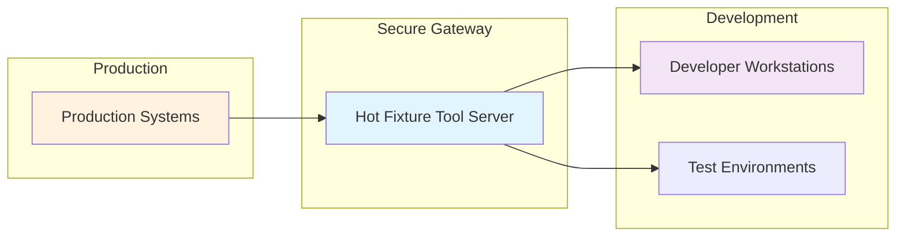

# Overview

## What is Hot Fixture Tool?

Hot Fixture Tool is a **production-data integration testing solution** designed to bridge the gap between synthetic test data and real-world complexity. It enables development teams to safely access, manage, and utilize production-like data for comprehensive integration testing.

## The Problem We Solve

### Development Challenge: The "Legacy Application Dilemma"

After 5-6 years of development, successful applications become "legacy" systems with:

- **Complex business logic** accumulated over years of feature development
- **Intricate data relationships** that reflect real business processes  
- **Edge cases and scenarios** that only exist in production environments
- **Technical debt** that makes changes risky without comprehensive testing

### Traditional Testing Limitations

#### Synthetic Test Data Problems
- **Oversimplified scenarios** that don't reflect production complexity
- **Missing edge cases** that cause production failures
- **Artificial data relationships** that don't match business reality
- **Limited coverage** of real-world user behaviors

#### Direct Production Access Issues
- **Security risks** from developer database access
- **Compliance violations** with data protection regulations
- **Performance impact** on production systems
- **Accidental data corruption** risks

## Our Solution: Controlled Production Data Access

### Architecture Philosophy

### Core Principles

#### 🔒 **Security by Design**
- **No direct database access** for developers
- **Authentication & authorization** for all operations  
- **Audit logging** of all data access
- **Data masking** capabilities for sensitive information

#### 🎯 **Developer Experience**
- **Simple CLI interface**: `hfit pkg-download scenario-name`
- **Template-driven workflows** for repeatable data packages
- **One-command setup** for integration test environments
- **Cross-platform compatibility** (Linux, macOS, Windows)

#### 🏗️ **Enterprise Scale**
- **Multi-database support** (MySQL, PostgreSQL, etc.)
- **Volume-based file management** for large datasets
- **Horizontal scaling** for high-demand environments
- **Docker-ready deployment** for containerized infrastructures

## Key Concepts

### Data Templates
**Reusable definitions** of data packages that include:
- Database queries for specific business scenarios
- File collections from configured volumes  
- Parameter substitution for dynamic scenarios
- Metadata for package documentation

### Volumes
**Configured file system locations** that provide:
- Secure access to file-based data
- Directory browsing and filtering capabilities
- Large file download support
- Access control and permissions

### Packages
**Generated data bundles** containing:
- Database exports in standard formats
- File collections from multiple volumes
- Metadata for import and usage instructions
- Reproducible snapshots for consistent testing

## Benefits by Role

### For Developers
- **Faster debugging** with real problem data
- **Comprehensive integration testing** without complex setup
- **Confidence in changes** through realistic test scenarios
- **Reduced "works on my machine" issues**

### For QA Engineers  
- **Realistic test data** that matches production complexity
- **Reproducible test scenarios** across environments
- **Edge case coverage** from real user interactions
- **Automated test data provisioning**

### For DevOps Teams
- **Secure data governance** with controlled access patterns
- **Audit trails** for compliance requirements  
- **Scalable infrastructure** supporting multiple teams
- **Integration-friendly** APIs and workflows

### For Product Teams
- **Faster feature delivery** through reliable testing
- **Higher quality releases** with comprehensive integration coverage
- **Reduced production incidents** from better pre-release validation
- **Data-driven development** with real user scenarios

## Technology Stack

### Server Components (hfitd)
- **Go-based daemon** for high performance and reliability
- **REST API** with OpenAPI/Swagger documentation
- **JWT authentication** with multiple key format support
- **Redis caching** for improved performance
- **Docker containerization** for easy deployment

### Client Components (hfit)
- **Cross-platform CLI** built with Go
- **SSH key authentication** (RSA, ECDSA, Ed25519)
- **Streaming downloads** for large datasets
- **Template management** with CRUD operations
- **Configuration management** with multiple backends

### Supported Databases
- **MySQL** (all modern versions)
- **PostgreSQL** (9.6+)
- **Extensible architecture** for additional database types

## Getting Started

Ready to transform your integration testing approach?

1. **[Quick Start Guide](quick-start.md)** - Get running in 15 minutes
2. **[Architecture Deep Dive](architecture.md)** - Understand the system design  
3. **[Use Case Examples](use-cases.md)** - See real-world applications

[Start Your Journey →](quick-start.md){ .md-button .md-button--primary }