# Developer Workflow Guide

The modern development landscape presents unique challenges when working with complex applications that require realistic data for testing and debugging. This guide demonstrates how Hot Fixture Tool transforms the developer experience by providing secure, controlled access to production-like data.

## The Developer Data Challenge

### The Problem: No Access to Real Data

Developers today face a fundamental disconnect between the code they write and the data they test with:

```mermaid
graph LR
    A[Developer Workstation] -.->|❌ No Access| B[Production Database]
    A --> C[Synthetic Test Data]
    C --> D[Limited Coverage]
    D --> E[Bugs in Production]
    E --> F[Long Debug Cycles]
```



#### **Security Barriers**
- **No direct production access**: Security policies rightfully prevent developers from connecting directly to production databases
- **Compliance restrictions**: GDPR, HIPAA, and other regulations limit data access
- **Audit requirements**: Every production data access must be logged and justified

#### **Synthetic Data Limitations**
- **Missing complexity**: Hand-crafted test data lacks the intricate relationships built over years of business operations
- **No edge cases**: Artificial data cannot anticipate the unusual combinations that occur in real-world usage
- **Outdated schemas**: Test data often lags behind production schema changes
- **Scale mismatch**: Small test datasets don't reveal performance issues that emerge with production-scale data

#### **Development Productivity Impact**
- **Slow debugging**: When production bugs occur, developers spend hours recreating the conditions
- **False confidence**: Tests pass with synthetic data but fail with real-world complexity
- **Integration failures**: Components work in isolation but break when integrated with realistic data flows
- **Hotfix anxiety**: No way to validate fixes against the actual data that caused issues

### The Traditional Workarounds (And Why They Fail)

#### **1. Mock Everything**
```python
# Traditional approach: Mock all external dependencies
@mock.patch('database.get_user')
@mock.patch('payment_service.process_payment')
def test_checkout_flow(mock_payment, mock_user):
    mock_user.return_value = {"id": 1, "name": "John"}
    mock_payment.return_value = {"status": "success"}
    # ... test logic
```

**Problems:**
- **Mocks drift**: Mock behavior diverges from real service behavior over time
- **Missing integration**: Tests pass but real integrations fail
- **Limited scenarios**: Hard to test complex, multi-step business workflows
- **Maintenance burden**: Mocks require constant updates as APIs evolve

#### **2. Database Snapshots**
```bash
# Traditional approach: Copy entire production database
mysqldump production_db > snapshot.sql
mysql test_db < snapshot.sql
```

**Problems:**
- **Security risk**: Full production data on developer machines
- **Privacy violations**: Personal data in development environments
- **Size issues**: Multi-gigabyte databases are impractical for daily use
- **Staleness**: Snapshots become outdated quickly

#### **3. Data Generators**
```python
# Traditional approach: Generate fake data
faker = Faker()
for i in range(1000):
    user = User(
        name=faker.name(),
        email=faker.email(),
        # ... more fields
    )
    db.save(user)
```

**Problems:**
- **No business logic**: Generated data doesn't reflect real business rules
- **Missing relationships**: Fails to capture complex inter-table dependencies
- **Performance blindness**: Artificial data patterns don't trigger real performance issues
- **Edge case gaps**: Can't generate the unusual data combinations that cause bugs

## The Hot Fixture Tool Solution

Hot Fixture Tool addresses these challenges by providing **secure, controlled access** to production-like data through a comprehensive template and package system.

### Core Developer Benefits

#### **🎯 Real Data, Real Scenarios**
Work with actual production data patterns while maintaining security and privacy:

```bash
# Download real user checkout scenarios
hfit pkg-download customer-checkout-complex

# Includes: actual product combinations, real payment methods, 
# genuine shipping addresses, authentic discount applications
```

#### **🔒 Security Without Compromise**
Access production data without security risks:
- **No direct database access**: Developers never connect to production systems
- **Controlled data export**: Only approved templates can extract data
- **Audit trails**: All data access is logged and tracked
- **Data masking**: Sensitive fields are automatically anonymized

#### **⚡ Instant Environment Setup**
Set up realistic test environments in seconds:

```bash
# Complete integration test setup
hfit pkg-download integration-test-suite
mysql test_db < integration-test-suite.sql
./run-integration-tests.sh
```

## Developer Workflow Patterns

### Pattern 1: Daily Development Flow

**The Challenge**: Starting each day with fresh, realistic test data.

**Traditional Approach:**
```bash
# Time-consuming manual setup
mysql test_db < old-test-data.sql  # Outdated
./generate-fake-data.py           # Unrealistic
# 30+ minutes of setup time
```

**Hot Fixture Tool Approach:**
```bash
# One-command fresh environment
hfit pkg-download daily-dev-scenario | mysql test_db
# Ready in under 2 minutes
```

#### **Step-by-Step Daily Workflow**

1. **Morning Setup** (2 minutes):
   ```bash
   # Authenticate once
   hfit login
   
   # Get fresh development data
   hfit pkg-download daily-dev-scenario > today-data.sql
   
   # Reset test database
   mysql test_db < today-data.sql
   ```

2. **Development Cycle** (continuous):
   ```bash
   # Make code changes
   vim src/checkout_service.py
   
   # Run tests with real data
   pytest tests/integration/test_checkout.py
   
   # Tests run against realistic scenarios
   ```

3. **Feature Testing** (as needed):
   ```bash
   # Test edge cases with specific scenarios
   hfit pkg-download edge-case-customers
   mysql test_db < edge-case-customers.sql
   pytest tests/edge_cases/
   ```

### Pattern 2: Bug Investigation & Hotfix Development

**The Challenge**: Reproducing production bugs locally.

**Traditional Approach:**
```python
# Try to guess what production data looked like
# Spend hours creating test scenarios
# Often fail to reproduce the exact conditions
# Deploy fixes without confidence
```

**Hot Fixture Tool Approach:**
```bash
# Extract data from the exact incident timeframe
hfit pkg-download incident-2024-1015 \
  start_time="2024-10-15 14:30:00" \
  end_time="2024-10-15 15:00:00"
```

#### **Complete Bug Investigation Workflow**

1. **Incident Report** (received):
   ```
   🚨 INCIDENT: Payment processing failed at 2024-10-15 14:45:00
   Error: "Invalid payment method for customer ID 12847"
   Affected customers: 23
   ```

2. **Data Extraction** (5 minutes):
   ```bash
   # Extract exact incident data
   hfit pkg-download payment-incident-2024-1015 \
     customer_ids="12847,15923,18442" \
     start_time="2024-10-15 14:30:00" \
     end_time="2024-10-15 15:00:00"
   
   # Import to debug environment
   mysql debug_db < payment-incident-2024-1015.sql
   ```

3. **Local Reproduction** (10 minutes):
   ```python
   # Run the exact failing scenario
   def test_payment_incident_reproduction():
       customer = get_customer(12847)  # Real customer data
       payment_method = get_payment_method(customer.id)  # Real payment data
       
       # Reproduce the exact failure
       result = process_payment(customer, payment_method)
       assert result.status == "failed"  # Confirms reproduction
   ```

4. **Fix Development** (30 minutes):
   ```python
   # Develop fix with confidence
   def process_payment(customer, payment_method):
       # Add validation that was missing
       if not validate_payment_method(payment_method, customer.region):
           return PaymentResult(status="failed", error="Invalid payment method")
       # ... rest of payment logic
   ```

5. **Fix Validation** (5 minutes):
   ```python
   # Test fix against real incident data
   def test_payment_fix_validation():
       # Same real data, now should work
       customer = get_customer(12847)
       payment_method = get_payment_method(customer.id)
       
       result = process_payment(customer, payment_method)
       assert result.status == "success"  # Fix confirmed
   ```

### Pattern 3: Integration Testing with Real Data Complexity

**The Challenge**: Testing component integration with realistic data flows.

**Traditional Approach:**
```python
# Oversimplified integration tests
def test_order_flow():
    user = create_test_user()  # Simple test data
    product = create_test_product()  # Basic product
    # Test passes but misses real-world complexity
```

**Hot Fixture Tool Approach:**
```bash
# Use real customer journeys for integration testing
hfit pkg-download customer-journey-comprehensive
```

#### **Advanced Integration Testing Workflow**

1. **Scenario Planning**:
   ```yaml
   # Define realistic test scenarios
   templateName: integration-test-suite
   description: "Comprehensive customer journey testing"
   exports:
     customers:
       provider: PROD_REPLICA
       query: |
         SELECT * FROM customers 
         WHERE last_purchase_date >= DATE_SUB(NOW(), INTERVAL 30 DAY)
         AND total_lifetime_value BETWEEN 1000 AND 5000
         LIMIT 50
     
     orders:
       provider: PROD_REPLICA
       query: |
         SELECT o.* FROM orders o
         INNER JOIN customers c ON o.customer_id = c.id
         WHERE c.id IN (SELECT id FROM customers LIMIT 50)
     
     products:
       provider: PROD_REPLICA
       query: |
         SELECT DISTINCT p.* FROM products p
         INNER JOIN order_items oi ON p.id = oi.product_id
         INNER JOIN orders o ON oi.order_id = o.id
         WHERE o.customer_id IN (SELECT id FROM customers LIMIT 50)
   ```

2. **Test Execution**:
   ```python
   class TestCustomerJourneyIntegration:
       def setup_method(self):
           # Load real customer journey data
           subprocess.run([
               "hfit", "pkg-download", "integration-test-suite"
           ], capture_output=True)
           
           # Import to test database
           subprocess.run([
               "mysql", "test_db"
           ], input=open("integration-test-suite.sql").read(), text=True)
       
       def test_complete_purchase_flow(self):
           # Test with real customer data
           customers = Customer.objects.all()
           
           for customer in customers[:10]:  # Test subset
               # Real product recommendations
               products = get_recommended_products(customer)
               
               # Real shopping cart behavior
               cart = ShoppingCart(customer)
               for product in products[:3]:
                   cart.add_item(product, quantity=random.randint(1, 3))
               
               # Real payment methods
               payment_method = customer.payment_methods.first()
               
               # Real address data
               shipping_address = customer.addresses.filter(
                   type="shipping"
               ).first()
               
               # Execute complete flow
               order = checkout_service.process_order(
                   cart=cart,
                   payment_method=payment_method,
                   shipping_address=shipping_address
               )
               
               # Validate against real business rules
               assert order.status in ["confirmed", "pending"]
               assert order.total > 0
               assert len(order.items) > 0
   ```

### Pattern 4: Performance Testing with Real Data Patterns

**The Challenge**: Performance issues only emerge with production-scale data patterns.

**Hot Fixture Tool Approach:**
```bash
# Extract data with real volume and distribution
hfit pkg-download performance-test-dataset \
  row_limit=100000 \
  include_indexes=true
```

#### **Performance Testing Workflow**

1. **Baseline Measurement**:
   ```bash
   # Get production-representative dataset
   hfit pkg-download performance-baseline \
     table_size_factor=0.1  # 10% of production size
   
   mysql perf_test_db < performance-baseline.sql
   ```

2. **Load Testing**:
   ```python
   def test_search_performance():
       # Test with real search patterns
       search_terms = get_real_search_terms()  # From production logs
       
       start_time = time.time()
       for term in search_terms[:1000]:
           results = search_service.search(term)
           assert len(results) >= 0
       
       duration = time.time() - start_time
       assert duration < 30.0  # Performance threshold
   ```

### Pattern 5: Legacy Application Modernization

**The Challenge**: Ensuring new implementations handle real business complexity.

#### **Migration Validation Workflow**

1. **Extract Representative Data**:
   ```bash
   # Get diverse business scenarios
   hfit pkg-download legacy-migration-validation \
     business_rules="complex_pricing,multi_currency,tax_calculations" \
     date_range="last_6_months"
   ```

2. **Parallel Testing**:
   ```python
   def test_legacy_vs_new_implementation():
       orders = Order.objects.all()
       
       for order in orders:
           # Run both implementations
           legacy_result = legacy_pricing_engine.calculate(order)
           new_result = new_pricing_engine.calculate(order)
           
           # Compare results with tolerance
           assert abs(legacy_result.total - new_result.total) < 0.01
           assert legacy_result.tax == new_result.tax
           assert legacy_result.discounts == new_result.discounts
   ```

## Advanced Developer Scenarios

### Scenario 1: Multi-Service Integration Testing

When developing microservices, testing service-to-service communication with realistic data:

```bash
# Download user service data
hfit pkg-download user-service-data

# Download order service data
hfit pkg-download order-service-data

# Download inventory service data  
hfit pkg-download inventory-service-data

# Set up complete microservice test environment
docker-compose up -d
./setup-test-databases.sh
```

### Scenario 2: Data Migration Validation

When migrating between database systems or schemas:

```bash
# Extract source data
hfit pkg-download migration-source-data

# Run migration scripts
./migrate-data.sh

# Extract post-migration data for comparison
hfit pkg-download migration-target-data

# Validate migration accuracy
./validate-migration.py
```

### Scenario 3: Feature Flag Testing

Testing new features with real user segments:

```bash
# Get data for feature flag segments
hfit pkg-download feature-flag-test-segments \
  user_segments="premium,enterprise,beta_users"

# Test feature with different user types
pytest tests/feature_flags/ --segments=all
```

## Productivity Metrics: Before vs After

### **Before Hot Fixture Tool**

| Activity | Time Required | Confidence Level |
|----------|---------------|------------------|
| Bug reproduction | 2-4 hours | Low (often can't reproduce) |
| Integration test setup | 30-60 minutes | Medium (synthetic data) |
| Performance testing | Half day | Low (unrealistic data patterns) |
| Hotfix validation | Deploy and hope | Very Low |
| New developer onboarding | 1-2 days | Low (complex setup) |

### **After Hot Fixture Tool**

| Activity | Time Required | Confidence Level |
|----------|---------------|------------------|
| Bug reproduction | 5-10 minutes | High (exact production data) |
| Integration test setup | 2-5 minutes | High (real data scenarios) |
| Performance testing | 15-30 minutes | High (production patterns) |
| Hotfix validation | 10-15 minutes | Very High |
| New developer onboarding | 30 minutes | High (one-command setup) |

### **ROI Calculation Example**

For a team of 10 developers:

**Time Savings per Developer per Day:**
- Bug investigation: 1.5 hours saved
- Test environment setup: 0.5 hours saved
- Integration debugging: 1 hour saved
- **Total: 3 hours per developer per day**

**Annual Team Productivity Gain:**
- 10 developers × 3 hours/day × 250 working days = **7,500 hours annually**
- At $100/hour fully-loaded cost = **$750,000 in productivity gains**

**Quality Improvements:**
- 60% reduction in production bugs due to better testing
- 40% faster hotfix deployment
- 80% reduction in failed deployments

## Best Practices for Developer Teams

### 1. **Template Organization**

Organize templates by use case and team:

```
templates/
├── daily-development/
│   ├── backend-dev-scenario.yaml
│   ├── frontend-dev-scenario.yaml
│   └── fullstack-dev-scenario.yaml
├── bug-investigation/
│   ├── payment-issues.yaml
│   ├── user-auth-problems.yaml
│   └── performance-incidents.yaml
├── integration-testing/
│   ├── api-integration-suite.yaml
│   ├── database-integration-suite.yaml
│   └── third-party-integration-suite.yaml
└── performance-testing/
    ├── load-test-dataset.yaml
    ├── stress-test-dataset.yaml
    └── endurance-test-dataset.yaml
```

### 2. **CI/CD Integration**

Integrate Hot Fixture Tool into your CI/CD pipeline:

```yaml
# .github/workflows/integration-tests.yml
name: Integration Tests
on: [push, pull_request]

jobs:
  integration-tests:
    runs-on: ubuntu-latest
    steps:
      - uses: actions/checkout@v2
      
      - name: Setup test database
        run: |
          hfit login --token ${{ secrets.HFIT_TOKEN }}
          hfit pkg-download ci-integration-suite > test-data.sql
          mysql test_db < test-data.sql
      
      - name: Run integration tests
        run: pytest tests/integration/
```

### 3. **Data Refresh Strategy**

Establish regular data refresh patterns:

```bash
# Weekly data refresh
0 2 * * 1 /usr/local/bin/hfit pkg-download weekly-refresh > /data/weekly-refresh.sql

# Daily development data
0 8 * * 1-5 /usr/local/bin/hfit pkg-download daily-dev > /data/daily-dev.sql

# On-demand incident data (triggered by alerts)
# Configured in monitoring system to automatically extract incident data
```

### 4. **Team Collaboration**

Share templates and scenarios across the team:

```bash
# Create shared team template
hfit pkg-tmpl create team-shared-scenario.yaml

# Other team members can use immediately
hfit pkg-download team-shared-scenario
```

## Troubleshooting Common Developer Issues

### Issue 1: "Data doesn't match my expectations"

**Problem**: Downloaded data doesn't contain expected records.

**Solution**: Check template query and filters:
```bash
# Debug template query
hfit pkg-tmpl show my-scenario --debug

# Adjust query parameters
hfit pkg-download my-scenario row_limit=1000 debug_mode=true
```

### Issue 2: "Performance is slow with downloaded data"

**Problem**: Real data exposes performance issues not seen with synthetic data.

**Solution**: This is a feature, not a bug! Use profiling tools:
```python
# Profile slow operations
import cProfile
cProfile.run('slow_operation(real_data)')

# Optimize based on real data patterns
```

### Issue 3: "Data is too large for local development"

**Problem**: Production-scale data overwhelms development environment.

**Solution**: Use data sampling and filtering:
```bash
# Sample data by percentage
hfit pkg-download large-dataset sample_rate=0.1

# Filter by date range
hfit pkg-download large-dataset \
  start_date="2024-01-01" \
  end_date="2024-01-31"
```

## Security Guidelines for Developers

### Do's
- ✅ Always use templates approved by your data governance team
- ✅ Regularly rotate authentication tokens
- ✅ Use data masking for sensitive fields
- ✅ Delete downloaded data when no longer needed
- ✅ Report any suspected data leaks immediately

### Don'ts
- ❌ Never share downloaded data files via email or public repositories
- ❌ Don't store sensitive data in version control
- ❌ Never attempt to reverse-engineer masked data
- ❌ Don't use production data for demos or training
- ❌ Never share authentication credentials

### Data Lifecycle Management

```bash
# Download with automatic cleanup
hfit pkg-download test-scenario --auto-cleanup 7d

# Manual cleanup
find ./test-data -name "*.sql" -mtime +7 -delete

# Secure deletion
shred -vfz -n 3 sensitive-test-data.sql
```

## Next Steps

Ready to transform your development workflow? Here's how to get started:

1. **[Quick Start](../getting-started/quick-start.md)** - Set up Hot Fixture Tool in 15 minutes
2. **[Authentication Guide](../client/authentication.md)** - Configure secure access
3. **[Template Creation](../guides/template-creation.md)** - Build your first data templates
4. **[Integration Examples](../guides/integration-examples.md)** - Real-world implementation patterns
5. **[Team Collaboration](../guides/team-collaboration.md)** - Scale across your organization

## Community and Support

- **GitHub Issues**: [Report bugs and request features](https://github.com/danielecr/hot-fixture-tool/issues)
- **Developer Discussions**: [Join the community](https://github.com/danielecr/hot-fixture-tool/discussions)
- **Best Practices**: [Share your workflows](https://github.com/danielecr/hot-fixture-tool/wiki)

---

*Transform your development workflow today. Work with real data, build confidence in your code, and deliver better software faster.*