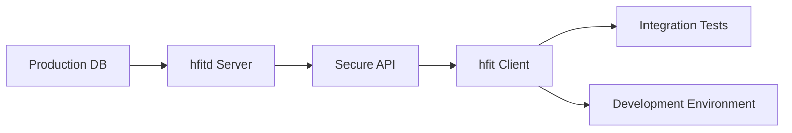
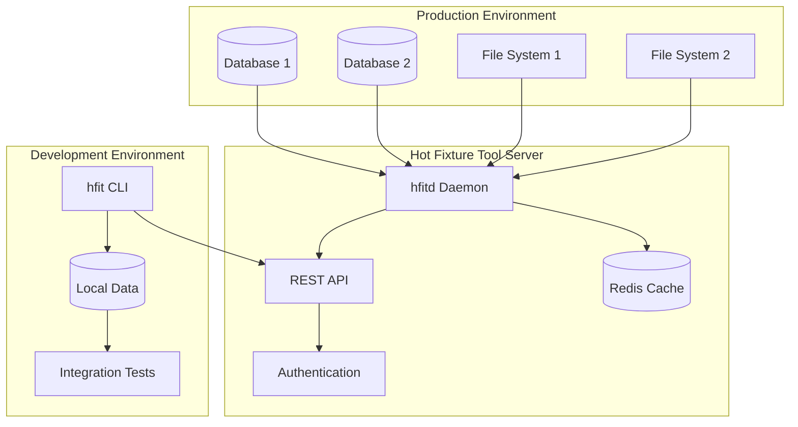

# Hot Fixture Tool

[](https://github.com/danielecr/hot-fixture-tool)
[](https://github.com/danielecr/hot-fixture-tool/stargazers)
[](https://github.com/sponsors/danielecr)

**Hot Fixture Tool** is a comprehensive solution for managing database fixtures and file resources in integration testing environments. It provides a powerful server-client architecture for retrieving, managing, and deploying "hot" data from production-like environments to support robust integration testing workflows.

## What is Hot Fixture Tool?

Hot Fixture Tool consists of two main components:

- **`hfitd` (Server)**: A daemon that runs on servers with access to databases and file systems, providing secure API access to data resources
- **`hfit` (Client)**: A command-line interface that connects to the server for data operations, template management, and fixture generation

## The Problem It Solves

### Legacy Application Challenges

Modern software development faces unique challenges when dealing with legacy applications:

- **Complex Business Logic**: Applications with 5-6 years of development contain intricate business rules that are difficult to replicate with synthetic test data
- **Real-World Data Complexity**: Production data contains edge cases, data relationships, and business scenarios that are impossible to anticipate in artificial test datasets
- **Integration Testing Gaps**: Unit tests cover code correctness, but integration tests require realistic data to validate actual business workflows
- **Hot Fix Verification**: When bugs occur in production, developers need access to the exact data conditions that caused the issue

### Traditional Approaches Fall Short

**Synthetic Test Data** limitations:
- Cannot replicate the complexity of real business scenarios
- Missing edge cases that only appear in production
- Lacks the data relationships built over years of business operations

**Production Database Access** problems:
- Security concerns with direct production access
- Performance impact on live systems  
- Compliance and privacy regulations
- Risk of accidental data modification

## The Hot Fixture Tool Solution

### Safe Production Data Access

Hot Fixture Tool provides a **secure, controlled way** to extract and manage production-like data:



### Key Benefits

#### 🔒 **Security First**
- No direct database access for developers
- Authentication and authorization controls
- Audit trails for all data operations
- Configurable data masking and filtering

#### 🚀 **Developer Productivity**
- One-command data retrieval: `hfit pkg-download test-scenario`
- Template-driven data packages
- Consistent test environments across teams
- Automated integration test setup

#### 🎯 **Testing Excellence** 
- Real-world data complexity in tests
- Reproducible test scenarios
- Hot fix validation with actual problem data
- Regression testing with historical datasets

#### 🏗️ **Enterprise Ready**
- Multi-database support (MySQL, PostgreSQL, etc.)
- Volume-based file management
- Docker deployment
- Horizontal scaling capabilities

## Core Use Cases

### 1. **Integration Test Data Management**
```bash
# Download a complete test scenario
hfit pkg-download customer-checkout-flow

# Includes: customer data, product catalog, order history, payment methods
# Ready for immediate integration testing
```

### 2. **Hot Fix Development & Validation**
```bash
# Extract data from the exact conditions that caused a bug
hfit pkg-download incident-2024-1015

# Reproduce the issue locally with real data
# Develop and test the fix
# Validate against actual problem scenarios
```

### 3. **Legacy Application Modernization**
```bash
# Extract representative business scenarios
hfit pkg-download legacy-migration-test-set

# Ensure new implementation handles real business complexity
# Validate data migrations with actual production patterns
```

### 4. **Continuous Integration Enhancement**
```bash
# Automated CI pipeline integration
hfit pkg-download ci-regression-suite
./run-integration-tests.sh
```

## Why Choose Hot Fixture Tool?

### For **Development Teams**
- **Faster debugging** with real data scenarios
- **Confidence in changes** through comprehensive integration testing  
- **Reduced time-to-market** with reliable test automation

### For **DevOps & Platform Teams**
- **Secure data governance** with controlled access patterns
- **Scalable infrastructure** supporting multiple teams and projects
- **Compliance-friendly** approach to production data usage

### For **QA & Testing Teams**
- **Realistic test scenarios** that mirror production complexity
- **Reproducible test environments** across different stages
- **Comprehensive coverage** of edge cases and business scenarios

## Quick Start

Get started with Hot Fixture Tool in minutes:

1. **Install the server** on a system with database access
2. **Configure data sources** via environment variables
3. **Install the client** on developer workstations
4. **Create data templates** for your test scenarios
5. **Download and use** real data in your tests

[Get Started →](getting-started/quick-start.md){ .md-button .md-button--primary }

## Architecture Overview



## Community & Support

- **GitHub Repository**: [danielecr/hot-fixture-tool](https://github.com/danielecr/hot-fixture-tool)
- **Issue Tracker**: [Report bugs and request features](https://github.com/danielecr/hot-fixture-tool/issues)
- **Sponsor**: [Support development](https://github.com/sponsors/danielecr)
- **Donate**: [PayPal](https://paypal.me/danielecruciani) | [Ko-fi](https://ko-fi.com/danielecruciani)

## License

Hot Fixture Tool is open source software licensed under the terms specified in the [LICENSE](https://github.com/danielecr/hot-fixture-tool/blob/main/LICENSE) file.