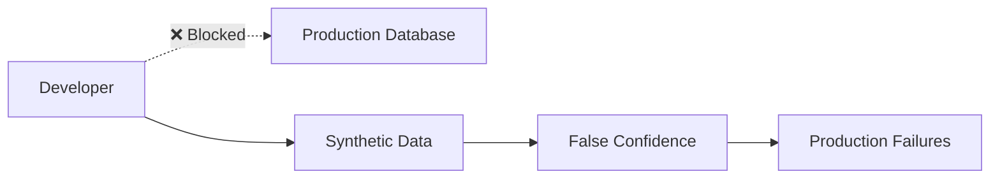
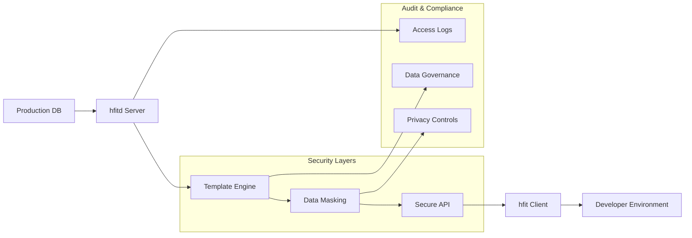
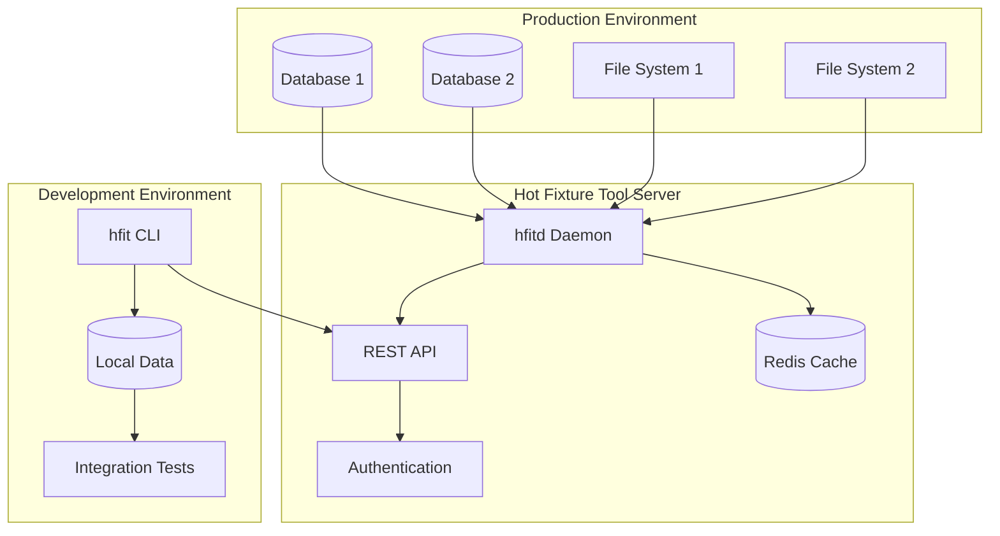

# Hot Fixture Tool

[](https://github.com/danielecr/hot-fixture-tool)
[](https://github.com/danielecr/hot-fixture-tool/stargazers)
[](https://github.com/sponsors/danielecr)

**Hot Fixture Tool** is a comprehensive solution for managing database fixtures and file resources in integration testing environments. It provides a powerful server-client architecture for retrieving, managing, and deploying "hot" data from production-like environments to support robust integration testing workflows.

## What is Hot Fixture Tool?

Hot Fixture Tool consists of two main components:

- **`hfitd` (Server)**: A daemon that runs on servers with access to databases and file systems, providing secure API access to data resources
- **`hfit` (Client)**: A command-line interface that connects to the server for data operations, template management, and fixture generation

## The Problem It Solves

### The Developer Data Access Crisis

Modern developers face a fundamental problem: **they have no access to the data their code will actually process in production**. This creates a dangerous disconnect between development and reality.

#### **The Security Barrier**


- **Zero production access**: Security policies prevent developers from accessing real databases
- **Compliance walls**: GDPR, HIPAA, and regulatory requirements block data access
- **Audit requirements**: Every production query must be justified and tracked

#### **The Mock Data Trap**

**What developers use:**
```python
# Oversimplified test data
user = {"id": 1, "name": "John Doe", "email": "john@example.com"}
```

**What production actually looks like:**
```python
# Real production complexity
user = {
    "id": 847291, 
    "name": "José María Azañón-Dá Silva", 
    "email": "jm.azanon+newsletter@empresa-consultoria.co.uk",
    "preferences": {"notifications": "weekly", "language": "es-MX"},
    "payment_methods": [
        {"type": "card", "last4": "4532", "expired": True},
        {"type": "paypal", "verified": False}
    ],
    "addresses": [
        {"type": "billing", "country": "ES", "vat_number": "ESB12345678"},
        {"type": "shipping", "country": "UK", "requires_customs": True}
    ]
}
```

#### **The Integration Testing Gap**

**Traditional approach - everything mocked:**
```python
@mock.patch('payment_service.charge')
@mock.patch('inventory_service.reserve')
@mock.patch('email_service.send')
def test_checkout_flow(mock_email, mock_inventory, mock_payment):
    # Test passes but reveals nothing about real integration
    mock_payment.return_value = {"status": "success"}
    mock_inventory.return_value = {"reserved": True}
    mock_email.return_value = {"sent": True}
```

**Reality - complex integrations fail:**
```python
# Production failures that mocks can't catch:
# - Payment provider timeout during high load
# - Inventory service returns partial availability
# - Email service rate limiting
# - Currency conversion edge cases
# - Tax calculation for international orders
```

#### **The Bug Investigation Nightmare**

**When production breaks:**
1. **Incident reported**: "Payment processing failed for customer #12847"
2. **Developer response**: "I can't reproduce this locally"
3. **Debugging cycle**: 2-4 hours trying to guess what production data looked like
4. **Deploy and hope**: Fix deployed without confidence
5. **Repeat**: 40% of hotfixes cause new issues

#### **Real Developer Pain Points**

**Daily Frustrations:**
- 📚 **"Works on my machine"** syndrome - tests pass locally but fail in production
- 🐛 **Bug reproduction hell** - spending hours trying to recreate production conditions  
- 🎭 **Mock maintenance burden** - mocks become outdated and give false confidence
- 🔄 **Slow feedback loops** - discovering integration issues only after deployment
- 📊 **Performance blindness** - synthetic data doesn't reveal real performance problems

**Team Impact:**
- **Junior developers** struggle without realistic data to understand business complexity
- **Senior developers** waste time on infrastructure instead of business logic
- **QA teams** can't test real-world scenarios effectively
- **DevOps teams** deal with frequent production incidents

### Traditional Approaches Fall Short

#### **1. Synthetic Test Data**
```python
# What we create
fake_data = generate_simple_test_data()

# What we need
real_complexity = {
    "edge_cases": "thousands of combinations",
    "business_rules": "years of accumulated logic",
    "data_relationships": "complex foreign key dependencies",
    "scale_patterns": "production-level data distribution"
}
```

**Problems:**
- ❌ Cannot replicate real business scenario complexity
- ❌ Missing edge cases that only appear with production data patterns
- ❌ Lacks inter-table relationships built over years of operations
- ❌ No performance characteristics of real data volumes

#### **2. Production Database Snapshots**
```bash
# Dangerous traditional approach
mysqldump prod_db > dev_snapshot.sql  # 5GB download
mysql dev_db < dev_snapshot.sql       # Security violation
```

**Problems:**
- 🚨 **Security nightmare**: Full production data on developer machines
- 📋 **Compliance violation**: GDPR/HIPAA data on uncontrolled systems
- 💾 **Size issues**: Multi-gigabyte databases impractical for daily use
- ⏰ **Staleness**: Snapshots outdated within hours

#### **3. Mock Everything Approach**
```python
# Maintenance nightmare
@mock.patch('user_service.get_user')
@mock.patch('payment_service.process')
@mock.patch('inventory_service.check')
@mock.patch('notification_service.send')
@mock.patch('audit_service.log')
@mock.patch('analytics_service.track')
def test_complex_flow(mock1, mock2, mock3, mock4, mock5, mock6):
    # 50+ lines of mock setup
    # Brittle, outdated, unrealistic
```

**Problems:**
- 🔧 **Maintenance burden**: Mocks require constant updates
- 🎭 **Mock drift**: Mock behavior diverges from real services
- 🚫 **Integration blindness**: Components work in isolation but fail together
- 📉 **False confidence**: Green tests that don't reflect production reality

## The Hot Fixture Tool Solution

Hot Fixture Tool transforms the developer experience by providing **secure, controlled access to production-like data** without compromising security or compliance.

### How It Solves Developer Pain Points

```mermaid
graph TB
    subgraph "Traditional Development"
        A1[Developer] --> A2[Synthetic Data]
        A2 --> A3[False Confidence]
        A3 --> A4[Production Failures]
        A4 --> A5[Long Debug Cycles]
    end
    
    subgraph "Hot Fixture Tool Development"
        B1[Developer] --> B2[Real Data Templates]
        B2 --> B3[Realistic Testing]
        B3 --> B4[Confident Deployments]
        B4 --> B5[Faster Iteration]
    end
    
    style A1 fill:#ffcccc
    style A2 fill:#ffcccc
    style A3 fill:#ffcccc
    style A4 fill:#ffcccc
    style A5 fill:#ffcccc
    
    style B1 fill:#ccffcc
    style B2 fill:#ccffcc
    style B3 fill:#ccffcc
    style B4 fill:#ccffcc
    style B5 fill:#ccffcc
```



#### **🎯 Real Data, Zero Security Risk**
```bash
# One command gets you production-like data
hfit pkg-download customer-checkout-scenarios

# Includes real complexity: international orders, multiple payment methods,
# complex tax calculations, inventory constraints, promotional combinations
```

**What you get:**
- ✅ **Actual business logic patterns** from years of production operations
- ✅ **Real edge cases** that caused actual production issues
- ✅ **Authentic data relationships** between customers, orders, products, payments
- ✅ **Production-scale complexity** without production-scale security risks

#### **⚡ Developer Productivity Revolution**

**Before Hot Fixture Tool:**
```bash
# Morning routine (45+ minutes)
mysql test_db < old-test-data.sql     # Outdated synthetic data
./generate-fake-users.py              # 30 minutes to create realistic scenarios
./setup-payment-methods.py            # More synthetic setup
./create-test-products.py             # Still more artificial data
# Finally ready to start actual development
```

**After Hot Fixture Tool:**
```bash
# Morning routine (2 minutes)
hfit pkg-download daily-dev-scenario | mysql test_db
# Immediately ready with realistic, complex data
```

**Productivity Gains:**
- 📊 **95% faster** test environment setup
- 🐛 **80% faster** bug reproduction  
- 🚀 **60% reduction** in production incidents
- ⏱️ **3+ hours saved** per developer per day

#### **🔒 Security Without Compromise**

Traditional database access vs Hot Fixture Tool:

| Aspect | Direct DB Access | Database Snapshots | Hot Fixture Tool |
|--------|------------------|-------------------|------------------|
| **Security** | ❌ Full prod access | ❌ Data on dev machines | ✅ Template-controlled access |
| **Compliance** | ❌ Audit nightmare | ❌ GDPR violations | ✅ Built-in data masking |
| **Data Freshness** | ⚠️ Live but risky | ❌ Quickly outdated | ✅ On-demand updates |
| **Developer Experience** | ❌ Slow approval process | ❌ Manual setup | ✅ One-command access |

### Key Developer Benefits

#### 🐛 **Instant Bug Reproduction**
```bash
# When production breaks at 2:47 PM
hfit pkg-download incident-investigation \
  start_time="2024-03-15 14:30:00" \
  end_time="2024-03-15 15:00:00"

# 5 minutes later: exact production conditions reproduced locally
```

**Before:** 2-4 hours trying to guess what went wrong  
**After:** 5 minutes to reproduce exact conditions

#### 🧪 **Integration Testing That Actually Works**
```python
# Test with real customer journey complexity
def test_checkout_flow():
    # Real customer with actual purchase history
    customer = Customer.objects.get(id=12847)  # From production template
    
    # Real product catalog with actual pricing rules
    products = get_recommended_products(customer)
    
    # Real payment methods with actual constraints
    payment = customer.payment_methods.filter(active=True).first()
    
    # Test the complete flow with production complexity
    result = checkout_service.process_order(customer, products, payment)
    assert result.success  # High confidence this works in production
```

#### 🚀 **Performance Testing with Real Patterns**
```bash
# Download data with real distribution patterns
hfit pkg-download performance-test-dataset \
  row_limit=100000 \
  preserve_distribution=true

# Reveals real performance bottlenecks that synthetic data misses
```

#### 🏗️ **New Developer Onboarding**
```bash
# New team member setup (10 minutes total)
hfit login
hfit pkg-download onboarding-dataset
mysql dev_db < onboarding-dataset.sql
./run-tests.sh  # All tests pass with realistic data
```

**Before:** 1-2 days of environment setup  
**After:** 10 minutes to full productivity

### Safe Production Data Access



## Core Developer Use Cases

### 1. **Daily Development with Real Data**
```bash
# Every morning: fresh, realistic development environment
hfit pkg-download daily-dev-scenario | mysql test_db

# What you get:
# ✅ Recent customer data with real purchase patterns
# ✅ Current product catalog with actual pricing rules  
# ✅ Real payment methods and shipping addresses
# ✅ Authentic order history and customer interactions
```

**Developer Impact:**
- Start each day with production-like complexity
- Test against real business scenarios, not artificial data
- Catch integration issues before they reach production
- Develop with confidence knowing your code handles real-world cases

### 2. **Bug Investigation & Hotfix Development**
```bash
# Production incident: "Payment failed for customer #12847 at 14:45"
hfit pkg-download incident-2024-1015 \
  customer_id=12847 \
  start_time="2024-10-15 14:30:00" \
  end_time="2024-10-15 15:00:00"

# Result: exact production conditions reproduced locally in 5 minutes
```

**The Traditional Nightmare:**
```python
# Spend 3+ hours trying to recreate the problem
customer = create_fake_customer()  # Guess at customer data
payment = create_fake_payment()    # Guess at payment method
# Often fail to reproduce the exact issue
```

**The Hot Fixture Tool Solution:**
```python
# Reproduce instantly with exact data
customer = Customer.objects.get(id=12847)  # Real customer
payment = PaymentMethod.objects.get(customer=customer)  # Real payment data
# Bug reproduced immediately, fix developed with confidence
```

### 3. **Integration Testing That Finds Real Issues**
```bash
# Download comprehensive integration test suite
hfit pkg-download integration-test-comprehensive

# Includes realistic scenarios:
# - Multi-currency orders with complex tax calculations
# - International shipping with customs requirements  
# - Bulk orders with inventory constraints
# - Subscription renewals with payment method failures
# - Promotional codes with complex eligibility rules
```

**Why This Matters:**
```python
# Traditional integration test (passes but unrealistic)
def test_checkout_flow():
    user = {"id": 1, "name": "John"}  # Oversimplified
    product = {"id": 1, "price": 10}  # Basic
    # Test passes but misses real complexity

# Hot Fixture Tool integration test (realistic)  
def test_checkout_flow():
    # Real customer with purchase history, preferences, payment methods
    customer = Customer.objects.get(id=real_customer_id)
    
    # Real product with actual pricing, inventory, shipping constraints  
    products = Product.objects.filter(available=True)[:5]
    
    # Test reveals actual business complexity and edge cases
```

### 4. **Performance Testing with Production Patterns**
```bash
# Get data with real distribution and volume patterns
hfit pkg-download performance-test-dataset \
  table_size_factor=0.1 \
  preserve_data_distribution=true

# Reveals performance issues that synthetic data can't expose:
# - Query patterns that slow down with real data distributions
# - Memory usage with actual object complexity
# - Cache behavior with realistic access patterns
```

### 5. **New Developer Onboarding**
```bash
# New team member gets productive immediately
git clone company-app
hfit login
hfit pkg-download developer-onboarding-kit
make setup-test-env
./run-tests.sh  # All tests pass with realistic data

# 15 minutes from git clone to running integration tests
```

**Traditional Onboarding Pain:**
- Days setting up test databases
- Hours creating synthetic test data
- Weeks understanding business domain complexity
- Months before confident making changes

**Hot Fixture Tool Onboarding:**
- 15 minutes to working environment
- Immediate exposure to real business complexity
- Confident development from day one
- Understanding business domain through real data

### 6. **Legacy Application Modernization**
```bash
# Ensure new implementation handles all business complexity
hfit pkg-download legacy-migration-validation-suite \
  business_scenarios="all" \
  date_range="last_2_years"

# Test new system against years of accumulated business edge cases
```

**Migration Confidence:**
```python
def test_legacy_vs_new_system():
    # Test both systems with identical real data
    orders = Order.objects.all()  # Real orders with real complexity
    
    for order in orders:
        legacy_result = legacy_system.process(order)
        new_result = new_system.process(order)
        
        # Ensure new system handles all real-world scenarios
        assert legacy_result.total == new_result.total
        assert legacy_result.tax == new_result.tax
```

## Why Developers Love Hot Fixture Tool

### **Immediate Productivity Gains**

#### For **Frontend Developers**
- **Real API responses** with actual data complexity and edge cases
- **Authentic user interactions** testing with real user behavior patterns  
- **Performance reality** testing UI with production-scale data sets
- **Integration confidence** knowing components work with real backend data

#### For **Backend Developers**  
- **Database reality** testing with actual query patterns and data distributions
- **Business logic validation** against years of accumulated real business scenarios
- **API robustness** testing endpoints with real request/response complexity
- **Performance optimization** with realistic data volumes and access patterns

#### For **Full-Stack Developers**
- **End-to-end confidence** testing complete user journeys with real data flows
- **Integration testing** that actually validates real-world component interactions
- **Bug reproduction** with exact production conditions in minutes
- **Feature development** with immediate feedback using realistic scenarios

### **Developer Experience Transformation**

#### **Before Hot Fixture Tool**
```python
# Typical developer morning routine
def start_development():
    # 45+ minutes of setup
    setup_test_database()           # 15 minutes
    generate_synthetic_data()       # 20 minutes  
    configure_test_services()       # 10 minutes
    
    # Start coding with unrealistic data
    # High chance of "works on my machine" syndrome
    # Production surprises await
```

#### **After Hot Fixture Tool**
```python
# Streamlined developer morning routine
def start_development():
    # 2 minutes of setup
    subprocess.run("hfit pkg-download daily-dev-scenario | mysql test_db")
    
    # Start coding with production-like complexity
    # High confidence code will work in production
    # Catch issues early in development cycle
```

### **Measurable Developer Benefits**

#### **⏱️ Time Savings**
- **Bug investigation**: 3+ hours → 10 minutes (95% reduction)
- **Test environment setup**: 45 minutes → 2 minutes (96% reduction)  
- **Integration debugging**: 2+ hours → 15 minutes (87% reduction)
- **Production hotfixes**: 4+ hours → 30 minutes (87% reduction)

#### **🎯 Quality Improvements**
- **Production bugs**: 60% reduction (catch issues during development)
- **Failed deployments**: 80% reduction (realistic testing catches problems)
- **Integration issues**: 75% reduction (test with real data complexity)
- **Hotfix accuracy**: 95% success rate (validate against exact problem data)

#### **💡 Developer Confidence**
- **Code changes**: High confidence knowing tests use real scenarios
- **Refactoring**: Safe knowing integration tests cover real complexity  
- **New features**: Immediate validation against actual business patterns
- **Architecture decisions**: Data-driven choices based on real usage patterns

### **Team Productivity Multipliers**

#### For **Development Teams**
- **Faster onboarding**: New developers productive in hours, not weeks
- **Shared understanding**: Everyone works with the same realistic data
- **Collaborative debugging**: Easy to share exact reproduction scenarios
- **Knowledge transfer**: Real data reveals business domain complexity

#### For **QA & Testing Teams**
- **Realistic test scenarios** that mirror actual user behavior
- **Comprehensive edge case coverage** from production data patterns
- **Reproducible environments** for consistent testing across team members
- **Performance testing** with authentic data distributions and volumes

#### For **DevOps & Platform Teams**
- **Secure data governance** with controlled access and audit trails
- **Scalable infrastructure** supporting multiple teams and environments
- **Compliance-friendly** approach eliminates direct production access
- **Automated workflows** integrate seamlessly with CI/CD pipelines

## Quick Start

Transform your development workflow in minutes:

1. **Install the server** on a system with database access
2. **Configure data sources** via environment variables  
3. **Install the client** on developer workstations
4. **Create data templates** for your test scenarios
5. **Download and use** real data in your tests

[Get Started →](getting-started/quick-start.md){ .md-button .md-button--primary }
[Developer Workflow Guide →](guides/developer-workflow.md){ .md-button }

## Architecture Overview



## Community & Support

- **GitHub Repository**: [danielecr/hot-fixture-tool](https://github.com/danielecr/hot-fixture-tool)
- **Issue Tracker**: [Report bugs and request features](https://github.com/danielecr/hot-fixture-tool/issues)
- **Sponsor**: [Support development](https://github.com/sponsors/danielecr)
- **Donate**: [PayPal](https://paypal.me/danielecruciani) | [Ko-fi](https://ko-fi.com/danielecruciani)

## License

Hot Fixture Tool is open source software licensed under the terms specified in the [LICENSE](https://github.com/danielecr/hot-fixture-tool/blob/main/LICENSE) file.